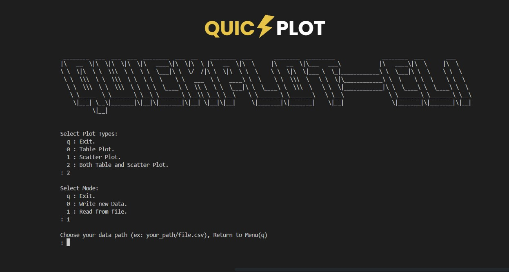

# QuickPlot CLI ⚡: Your lightweight tool for quick data visualization in C.

> [!NOTE]
> We created this project for being team project work we send in `Computer Programming Course CPE100`

***We found that***

- Most plotting libraries are written in `C++` (It's hard to implement in `C` since no OOP)
- Most plotting libraries aren't designed to work in the terminal, so they often rely on image rendering programs to display graphs.

With this  `CLI` give you ability to **plot** your data into  ***lightweight** and **beautiful** command line* charts. Feeling like a senior cybersecurity dude 😎

### Features 📈

- Table Plot
- Scatter Plot
- File Write, Import and Export (csv format)
- Basic statistical calculations (STD, Mean, Median, Mode etc.)
- Plot Settings & More !

### Usage ⚙️

compile and run `src/plot.c` file. Enjoy ;D !

### For More Details
This repository is `CLI` version of [***📈 CTerminalPlotLib***](https://github.com/Jakkarin-Promsee/CTerminalPlotLib) Check out Mr.Jakkarin of his incredible work which he optimized it for best practice !

