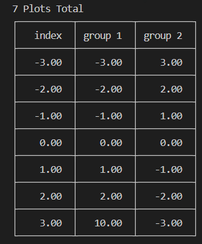
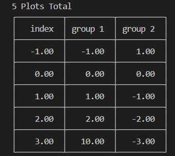
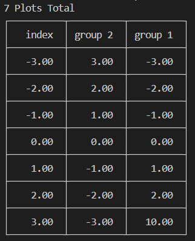
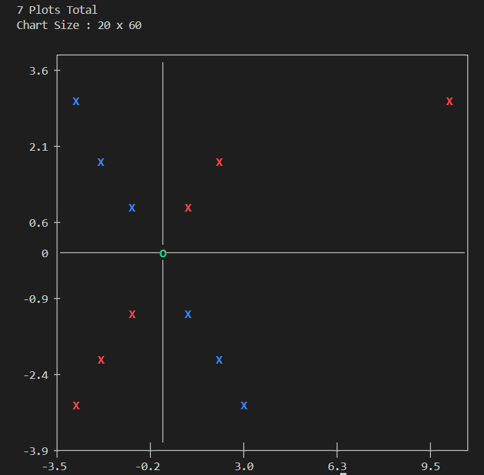
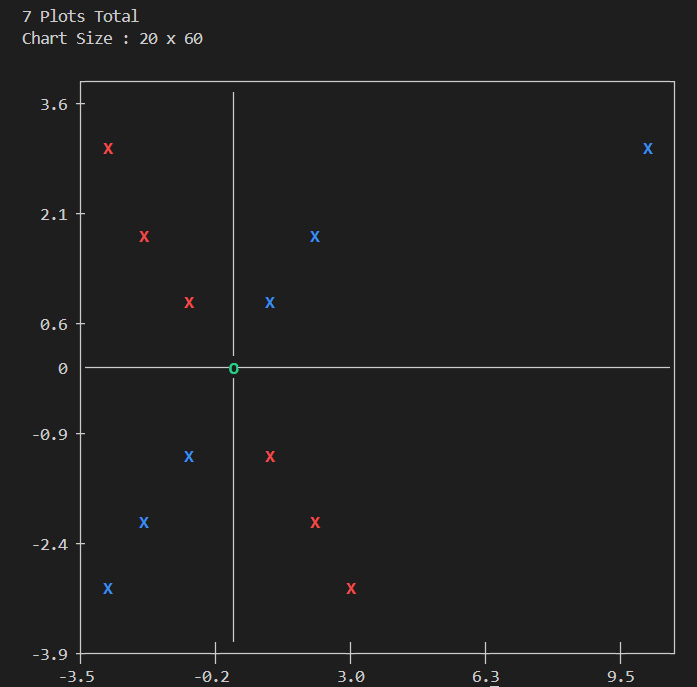
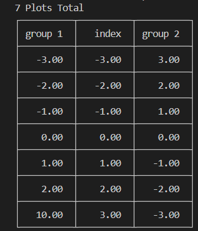
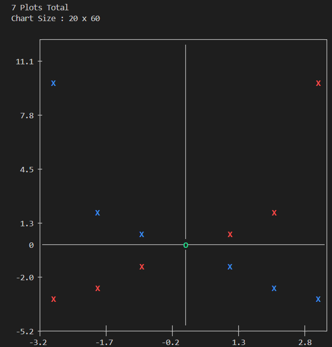

# CTerminalPlot
`CTerminalPlot` is a lightweight C library designed for **table plotting** and **scatter plotting**  graphs directly in the terminal, using the `CP_UTF8` encoding codepage identifier. This library provides a quick and real-time data visualization solution with a default resolution of 30x90 pixels, which can be scaled up depending on your terminal's capabilities. With syntax similar to `Matplotlib`.

## Features
- **Lightweight Design:** Optimized for embedded systems and semi-computer platforms like Arduino and NodeMCU which have less memory and cpu power.
- **Adjustable Data Types:** Supports multiple data types, including `bool` (1 bit), `char` (1 byte), `int` (4 bytes), `float` (8 bytes), and `double` (16 bytes).
- **Flexible Storage Management:** Using dynamic adjustment of rows, columns, and parameter declarations to optimize memory usage.
- **Matplotlib-Like Syntax:** Offers a familiar syntax for those accustomed to Python's Matplotlib.
- **Multi-Parameter Support:** Enables plotting multiple variables simultaneously with automatic and customizable controls. Which variables have diffent color on graph.
- **Search Function Support:** Have function to search data with multiple parameter.
- **UTF-8 Encoding:** Displays graphs with graphics and colored lines in the terminal, enhancing readability.

<br><br>
# Getting Started
Here’s an example of how to set up and use the library:

## **Setup Data Set**

- ### Initialize the Data Set
    ```c++
    int max_cols_size = 3, max_name_legth = 20, max_rows_size = 10;
    DataSet *dataSet = ctp_initialize_dataset(max_cols_size, max_name_legth, max_rows_size);
    ```
    - `max_cols_size`: The maximum number of parameter columns.
    - `max_name_legth`: The maximum number of characters for a column name.
    - `max_rows_size`: The maximum amount of data entries to store per column.

- ### Add Data
    ```c++
    int available_cols = 3, available_rows = 7, max_rows = 10;
    // data[][max_rows]
    CTP_PARAM data[][10] = {{-3, -2, -1, 0, 1, 2, 3}, // Column 0 (default y-axis)
                            {-3, -2, -1, 0, 1, 2, 10}, // Column 1 (default x-axis)
                            {3, 2, 1, 0, -1, -2, -3}}; // Column 2 (default x-axis)
    ctp_add_data(dataSet, data, max_rows, available_cols, available_rows);
    ```
    - `available_cols`: The number of columns to add to the dataset.
    - `available_rows`: The number of rows to add to the dataset.
    - `max_rows`: The maximum number of rows in the dataset (used to calculate the address of data in the array).

- ### Add Labels
    ```c++
    int available_name = 3, max_name_length = 20;
    // name[][max_name_length]
    char name[][20] = { "index",   // Column 0 (default y-axis)
                        "group 1", // Column 1 (default x-axis)
                        "group 2"};  // Column 2 (default x-axis)
    ctp_add_label(dataSet, name, max_name_length, available_name);
    ```
    - `available_name`: The number of column labels to add to the dataset.
    - `max_name_length`: The maximum length of each label (used to determine the size of the name array).

## **Getting Plot**
- ### Plotting
    - ### Default Plotting (Table and Scatter Plot)
        ``` c++
        ctp_plot(dataSet);
        ```
    - ### Specific Plotting
        - Table Plot
            ``` c++
            ctp_plot_table(dataSet);
            ```
        - Scatter Plot
            ``` c++
            ctp_plot_scatter(dataSet);
            ```
- ### Output
    - ### Table plot
        <br>
    - ### Scatter plot
        <br>

## **Getting Search**
- ### Searching data
    - ### operator
        - `e`: Equal (==)
        - `ne`: Not equal (!=)
        - `lt`: Less than (<)
        - `lte`: Less than or equal (<=)
        - `gt`: Greater than (>)
        - `gte`: Greater than or equal (>=)

    - ### FindOne
        - ### Usage:
            ``` c++
            void ctp_findOne(DataSet *dataSet, int select_col, char operator[], CTP_PARAM search_value)
            ```
        - ### Example:
            ``` c++
            ctp_findOne(dataSet, 0, "gte", -1);
            ```
            This function finds the first data entry in column 0 that is greater than or equal to -1.

    - ### FindMany
        - ### Usage:
            ``` c++
            void ctp_findMany(DataSet *dataSet, int select_col, char operator[], CTP_PARAM search_value)
            ```
        - ### Example:
            ``` c++
            ctp_findMany(dataSet, 0, "gte", -1);
            ```
            This function finds all data entries in column 0 that are greater than or equal to -1.

- ### Ploting search data
    - ### Default Plotting (Table and Scatter Plot)
        ``` c++
        ctp_plot_search(dataSet);
        ```
    - ### Specific Plotting
        - Table Plot
            ``` c++
            ctp_plot_table_search(dataSet);
            ```
        - Scatter Plot
            ``` c++
            ctp_plot_scatter_search(dataSet);
            ```

- ### Output
    ``` c++
    ctp_findMany(dataSet, 0, "gte", -1);
    ```
    Use this function to be example for searching data based on specified conditions.
    - ### Table plot
        - **Default Table Plot**  
              

        - **Search Table Plot**  
              

    - ### Scatter plot
        - **Default Scatter Plot**  
            
        - **Search Scatter Plot**  
            

## Additional Check Propoties Function
- ### Get Memory Usage for Dataset Initialization

    ```c++
    ctp_printf_memory_usage(dataSet);
    ```

    Output:  
    ``` sql
    DataSet uses type float to keep data
    This DataSet memory usage is 454 Bytes
    ```

    The memory usage is **454 Bytes** for the following configuration:  
    - `max_param = 3`:  3 columns
    - `max_name_size = 10`: 10 character name length for each column
    - `max_param_size = 10`: 10 rows of data per column

    This calculation assumes the default variable type: `float`.

- ### Check all dataset background propoties
    ```c++
    ctp_printf_properties(dataSet);
    ```

    Output:  
    ``` sql
    max_param: 3
    max_name_size: 10
    max_param_size: 10
    db_rows_size: 7
    db_cols_size: 3
    chosen_Y_param: 0
    chosen_X_param_size: 0
    chosen_X_param:
    show_begin: 0
    show_end: 0
    plotProperties:
    - table_plot: true
    - scatter_plot: true
    - line_plot: true
    ```

## Customize Plotting (Swapping column)

- ### Setup Plotting Variable
    1. Set customize display to true
        ```c++
        dataSet->plotProperties->customize_display = true;
        ```
    2. Choose the column to be the Y-axis:
        ```c++
        dataSet->chosen_Y_param = 0; // Set column 0 to Y
        ```
    3. Choose columns to be the X-axes:
        ```c++
        dataSet->chosen_X_param_size = 2; // Have 2 X axes
        dataSet->chosen_X_param[0] = 2; // Set column 2 to X1
        dataSet->chosen_X_param[1] = 1; // Set column 1 to X2
        ```
        With the default data, swapping columns will change the X1 and X2 axes.
    4. Set the index range to display:
        ```c++
        dataSet->show_begin = 0; // Begin at row 0
        dataSet->show_end = 7; // End at row 7
        ```
    5. Plotting:
        ```c++
        ctp_plot(dataSet);
        ```

- ### Output
    Swapping column X1 and X2 results in the following plots:

    - ### Table Plot
        - **Default Table Plot**  
              

        - **Customized Table Plot**  
              

    - ### Scatter Plot
        - **Default Scatter Plot**  
              

        - **Customized Scatter Plot**  
              

## Customize Plotting (Swapping Axis)

- ### Setup Plotting Variable
    1. Set customize display to true
        ```c++
        dataSet->plotProperties->customize_display = true;
        ```
    2. Choose the column to be the Y-axis:
        ```c++
        dataSet->chosen_Y_param = 1; // Set column 1 to Y
        ```
    3. Choose columns to be the X-axes:
        ```c++
        dataSet->chosen_X_param_size = 2; // Have 2 X axes
        dataSet->chosen_X_param[0] = 0; // Set column 0 to X1
        dataSet->chosen_X_param[1] = 2; // Set column 2 to X2
        ```
        With the default data, swapping columns will change the X1 and X2 axes.
    4. Set the index range to display:
        ```c++
        dataSet->show_begin = 0; // Begin at row 0
        dataSet->show_end = 7; // End at row 7
        ```
    5. Plotting:
        ```c++
        ctp_plot(dataSet);
        ```

- ### Output
    Swapping column X1 and X2 results in the following plots:

    - ### Table Plot
        - **Default Table Plot**  
              

        - **Customized Table Plot**  
              

    - ### Scatter Plot
        - **Default Scatter Plot**  
              

        - **Customized Scatter Plot**  
              
